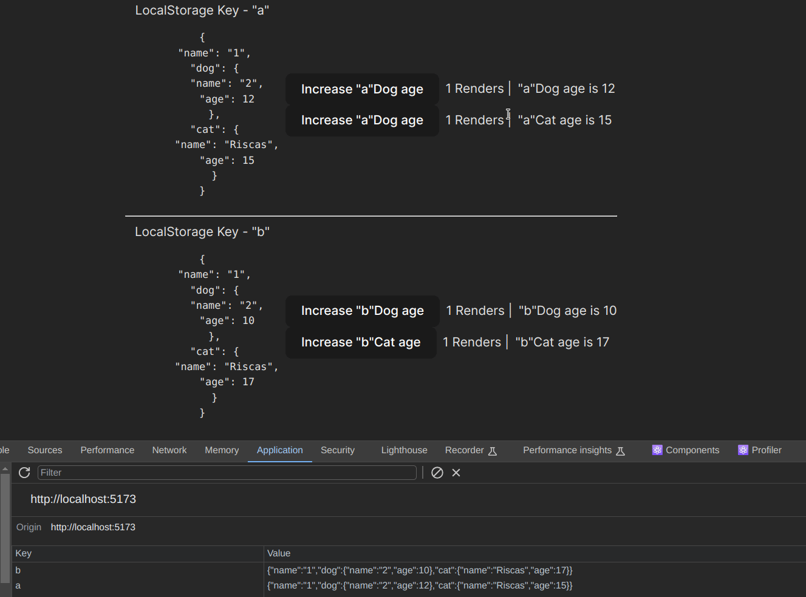

# use-safe-local-storage

The **simplest** and **safest** way to manage local storage within a React application.



## Installation

```bash
npm install use-safe-local-storage
```

## Setup

1- Define a `zod` schema for your local storage data.

```typescript
const localStorageSchema = z.object({
  themePreference: z.enum(['light', 'dark']),
  userSettings: z.object({
    rememberPassword: z.boolean(),
  }),
});
```

2- Extract your type-safe hook/functions using the `defineLocalStorage` util.

```typescript
const localStorageSchema = z.object({
  themePreference: z.enum(['light', 'dark', 'system']),
  userSettings: z.object({
    rememberPassword: z.boolean(),
  }),
});

export const { useSafeLocalStorageSelector, setLocalStorage, getLocalStorage } =
  defineLocalStorage({
    schema: localStorageSchema,
    initialValue: {
      themePreference: 'system',
      userSettings: { rememberPassword: true },
    },
    localStorageKey: 'local-storage-key',
  });
```

## Usage within components

Use the `useSafeLocalStorageSelector` hook to subscribe to fine-grained changes in your local storage.

```typescript
import { useSafeLocalStorageSelector } from 'local-storage';

const MyComponent = () => {
  // only re-renders when the `themePreference` key changes
  const themePreference = useSafeLocalStorageSelector(
    (state) => state.themePreference
  );

  return (
    <div>
      <h1>Theme Preference: {themePreference}</h1>
    </div>
  );
};
```

## Usage outside of React components/hooks

Use the `getLocalStorage` and `setLocalStorage` functions to interact with local storage.

```typescript
import { getLocalStorage, setLocalStorage } from 'local-storage';

// isn't reactive, because it doesn't hook into the React lifecycle
const themePreference = getLocalStorage((state) => state.themePreference);

// dispatches a change to all subscribers of the `themePreference` key
setLocalStorage((oldState) => ({ ...state, themePreference: 'dark' }));
```

## Extra features

- **Type-safe**: The `zod` schema ensures that your local storage data is always in sync with your application's types.

- **Reactive**: The `useSafeLocalStorageSelector` hook ensures that your components re-render when the local storage data changes.

- **Performance**: The `useSafeLocalStorageSelector` hook uses a memoized selector to avoid unnecessary re-renders.

- **Flexibility**: The `getLocalStorage` and `setLocalStorage` functions allow you to interact with local storage outside of React components/hooks.

- **Customization**: The `defineLocalStorage` util allows you to define your own custom hooks and functions for interacting with local storage.

- **Sync across tabs**: The `setLocalStorage` function uses the `storage` event to keep local storage in sync across all tabs.
